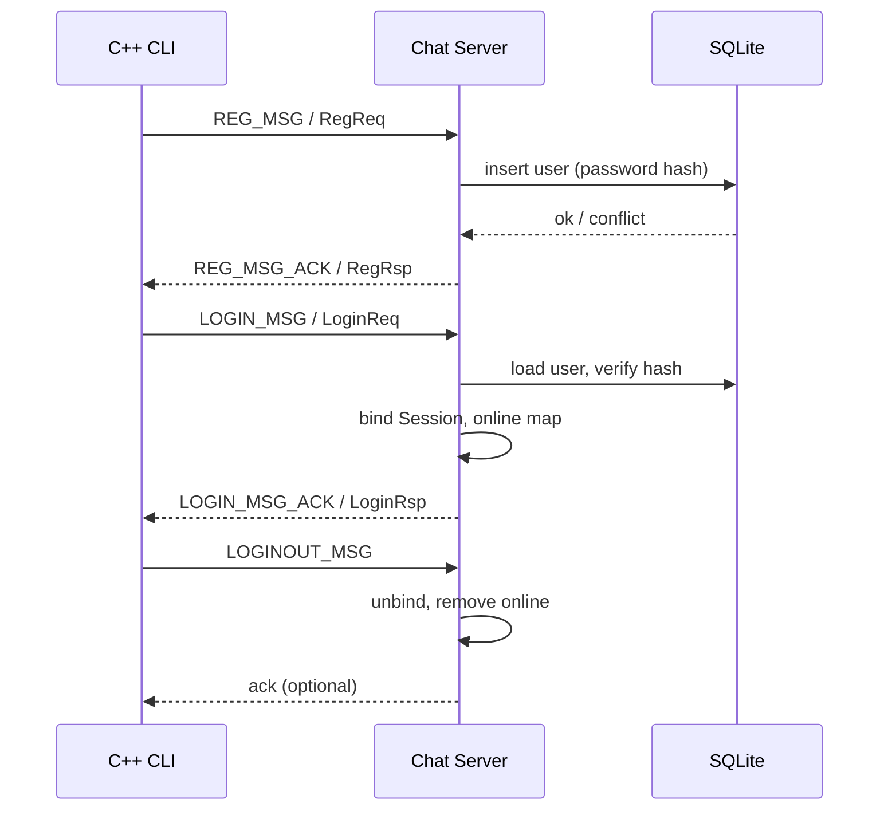

# ChatServer：Boost + Protobuf 账号里程碑需求

## Summary

在现有 Boost.Asio + 长度前缀 Protobuf 网络上，完成**学习型 IM 后端的第一个里程碑：账号体系**（注册、登录、登出、在线会话绑定、SQLite 持久化、密码哈希存储），配套 **C++ 交互式 CLI 客户端** 做端到端演示；**一次性移除**全部 muduo 遗留代码。单聊、群聊、离线消息与 Web 前端接入列为后续里程碑，本阶段不实现。

## Problem Frame

仓库处于双栈并存状态：新的 Boost 路径仅有登录/注册桩逻辑，而 `src_bak` 与 `include/server` 仍保留基于 muduo 的完整业务骨架（MySQL、Redis、好友/群组等）。继续两套代码并行会增加学习成本，也不利于按 Protobuf 协议统一演进。

目标是按 **Boost + Protobuf** 模式把项目做成可逐步扩展的 IM 后端，最终对齐主流聊天能力，但当前阶段以**掌握网络与会话架构**为主，而非生产上线。因此需要先收敛技术栈、打通账号闭环，再按里程碑叠加聊天能力。

## Key Decisions

- **里程碑策略（方案 A）**：本阶段只做账号体系；其余 `MsgType`（单聊、群聊、好友等）不实现业务，可在协议层保留类型供后续扩展。
- **持久化**：用户数据使用 **SQLite**（非 MySQL）；旧 `src_bak` 数据层仅作字段与流程参考，不迁回。
- **密码**：注册时写入 **单向哈希**（如 bcrypt 或同等强度的现代哈希）；登录时对提交密码做相同算法校验，**禁止**明文或可逆存储。
- **传输**：本阶段维持 **TCP + 4 字节长度前缀 + `ChatEnvelope`**；Web SPA 接入通过**后续 WebSocket 网关里程碑**解决，不在本阶段引入 HTTP/WebSocket。
- **客户端**：里程碑验收使用 **C++ 交互 CLI**；好看的前端（React/Vue 等）为**明确后置**目标。
- **遗留清理**：从主工程中**删除** muduo 相关目录与引用（含 `include/server`、`src_bak`、`test/testmuduo` 等），CMake 只构建 Boost 栈目标。
- **在线态**：服务端维护 **userId → 活跃 Session** 映射；同一账号重复登录时的挤下线策略见 R9。

## Requirements

**遗留代码与工程结构**

- R1. 主工程 CMake 仅构建 Boost + Protobuf 服务端与 CLI 客户端，不再链接或引用 muduo、旧 MySQL/Redis 模块。
- R2. 删除 muduo 时代的服务端/客户端源码树及 muduo 测试目录，避免双栈并存。

**网络与会话（延续 README 阶段 1 目标）**

- R3. TCP 帧格式为 `[4 字节 body 长度][protobuf 序列化 body]`，读侧使用缓冲 + 状态机，禁止单次 `read_some` 当作完整包。
- R4. 写侧使用发送队列 +「正在写」标志，避免对同一 socket 并发 `async_write`。
- R5. 连接断开后，若 Session 已绑定 userId，须从在线表中移除并释放资源。

**协议与消息分发**

- R6. 应用层消息统一为 `ChatEnvelope`（`msgid` + `payload`）；业务请求/响应放在 `payload` 内按类型反序列化。
- R7. 本阶段须实现并打通：`REG_MSG` / `REG_MSG_ACK`、`LOGIN_MSG` / `LOGIN_MSG_ACK`、`LOGINOUT_MSG`（及对应 ack，若 proto 中定义）。
- R8. 对尚未实现的 `MsgType`，服务端返回明确错误（日志 + 可选错误响应），不得静默丢弃或崩溃。

**账号与数据**

- R9. 注册：校验用户名唯一性；成功则分配 userId 并持久化；失败返回可区分的错误码与说明。
- R10. 登录：校验 userId（或约定标识）与密码；成功则绑定 Session、加入在线表；失败不绑定。
- R11. 登出：解除 Session 与 userId 绑定、从在线表移除；已登出连接上的后续业务消息应拒绝或忽略。
- R12. 同一 userId 再次登录时，默认**挤掉**旧 Session（旧连接收到可感知结果后关闭）；若实现多设备共存，须在 Key Decisions 中显式改写并更新验收用例。
- R13. 用户表至少包含：唯一 userId、唯一用户名、密码哈希、账号状态字段（如 offline/online，用于学习演示即可）。

**客户端（里程碑验收）**

- R14. 提供 C++ 交互 CLI：菜单或命令驱动，可完成注册、登录、登出，并打印服务端 ack 中的错误码与文案。
- R15. CLI 与服务端共用同一套帧编码与 `ChatEnvelope` 协议（可复用 `Codec` 逻辑）。

## Actors

- A1. **终端用户**：通过 CLI 注册、登录、登出。
- A2. **Chat 服务端**：接受 TCP 连接、解析帧、路由 `MsgType`、访问 SQLite、维护在线 Session。
- A3. **SQLite 数据库**：持久化用户账号（本阶段不承载聊天消息）。

## Key Flows

- F1. **注册**
  - **Trigger:** CLI 发送 `REG_MSG`。
  - **Actors:** A1, A2, A3
  - **Steps:** 解析 `RegReq` → 检查用户名是否已存在 → 哈希密码 → 写入 SQLite → 返回 `RegRsp`（含 userId 或错误）。
  - **Outcome:** 新账号可随后用于登录。
  - **Covered by:** R7, R9, R13, R14

- F2. **登录**
  - **Trigger:** CLI 发送 `LOGIN_MSG`。
  - **Actors:** A1, A2, A3
  - **Steps:** 解析 `LoginReq` → 查用户 → 校验密码哈希 → 绑定 Session.userId → 注册在线表 → 若已有旧 Session 则按 R12 处理 → 返回 `LoginRsp`。
  - **Outcome:** 该连接代表已登录用户。
  - **Covered by:** R7, R10, R12, R14

- F3. **登出**
  - **Trigger:** CLI 发送 `LOGINOUT_MSG` 或连接主动断开。
  - **Actors:** A1, A2
  - **Steps:** 解析登出请求（若有）→ 清 Session 绑定 → 从在线表移除 → 返回 ack（若有）→ 可选保持 TCP 或关闭连接（须在实现计划中二选一并写入验收）。
  - **Outcome:** 用户在该连接上不再处于登录态。
  - **Covered by:** R5, R7, R11, R14

## Acceptance Examples

- AE1. **Covers:** R9  
  - **Given:** 数据库中不存在用户名 `alice`  
  - **When:** CLI 注册 `alice` + 合法密码  
  - **Then:** 返回成功 errcode，分配新 userId；再次用同用户名注册失败且错误可区分。

- AE2. **Covers:** R10  
  - **Given:** 已存在用户 `alice` 且密码正确  
  - **When:** CLI 使用错误密码登录  
  - **Then:** 登录失败，Session 未绑定 userId，在线表中无该连接。

- AE3. **Covers:** R12  
  - **Given:** 用户已在连接 A 登录  
  - **When:** 同一用户在连接 B 再次登录成功  
  - **Then:** 连接 A 被挤下线或收到明确失败；连接 B 为当前唯一有效在线 Session（与 R12 默认策略一致）。

- AE4. **Covers:** R5, R11  
  - **Given:** 用户已登录  
  - **When:** 发送登出或 TCP 断开  
  - **Then:** 在线表不再包含该 userId（除非 R12 多设备策略另有约定）；重连后须重新登录才能绑定。

## Success Criteria

- 本地可编译运行服务端与 CLI，无 muduo 依赖。
- 连续完成：注册新用户 → 登录 → 登出（或断开）→ 用错误密码登录失败，全程无崩溃，SQLite 中可见用户记录且密码字段为哈希而非明文。
- 代码结构清晰：网络（Session/Codec）、业务（ChatService）、数据访问分层可读，便于下一里程碑接入单聊。

## Scope Boundaries

**本阶段包含**

- 账号里程碑（R1–R15）及 F1–F3。

**Deferred for later（后续里程碑）**

- 一对一聊天、好友关系、加好友。
- 群组创建、加群、群聊广播。
- 离线消息存储与拉取、Redis 在线/订阅。
- Web SPA 前端与 WebSocket（或 HTTP）接入层。
- 文件/图片消息、已读回执、消息漫游等「主流 IM」进阶能力。

**Outside this product's identity（本学习项目暂不追求）**

- 多机部署、服务发现、水平扩展。
- 生产级风控（设备指纹、验证码、审计日志）。
- 替换为 MySQL 集群或引入消息队列的中间件架构。

## Dependencies / Assumptions

- 开发环境已具备 Boost、Protobuf（与当前 `CMakeLists.txt` 一致的工具链）。
- 引入 SQLite 可通过系统包或 vendored 库，由实现计划选定；本需求只要求持久化能力成立。
- 密码哈希库（bcrypt 等）由实现计划选型，须满足 R13「不可逆存储」。
- 旧 `src_bak` 在删除前如需对照字段含义，应先完成阅读再删，避免丢失业务语义参考。

## Outstanding Questions

**Deferred to Planning**

- 登出后 TCP 连接是保持还是主动关闭。
- `LoginReq` 以 userId 还是用户名为登录键（需与 proto 字段及 CLI 输入一致）。
- 哈希算法具体库选型与 cost factor 默认值。
