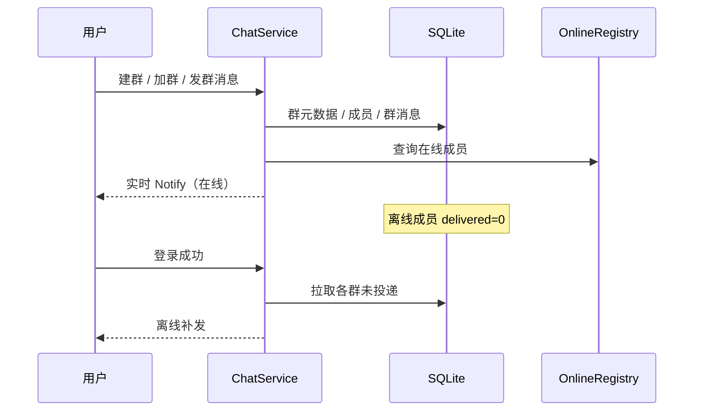

# 群聊（建群 / 加群 / 群消息）— 需求说明

**状态**：draft（brainstorm 产出，待 `/ce-plan`）  
**目标版本**：v0.4.0（与已发布的 v0.4.1 单聊历史拆分，避免单里程碑过大）  
**背景**：`proto/chat.proto` 已预留 `CREATE_GROUP_MSG` / `ADD_GROUP_MSG` / `GROUP_CHAT_MSG`，业务与存储尚未实现；路线图将群聊列为下一主题。

---

## Summary

为已登录用户提供**可自助加入**的群组：建群时设置名称、简介与「公开 / 需审批」模式；成员可凭 `group_id` 加入或申请加入；支持群消息**实时推送**、**登录离线补发**、**群历史分页**与**我的群列表**。群主独享审批与群设置权限；第一版支持成员主动退群，不做踢人与解散。

---

## Problem & Outcome

**问题**：当前仅支持好友单聊，无法演示 IM 中常见的多人群组会话；协议枚举已占位但无行为与持久化。

**成功时用户能**：

- 创建群组并获得稳定 `group_id`，选择公开或需审批
- 通过 `group_id` 加入公开群，或向需审批群提交申请并由群主同意
- 在群内发消息：在线成员实时收到；离线成员登录后收到未投递群消息
- 查看自己加入的群列表，并按群拉取历史记录（分页）
- 主动退出群组；非法或非成员操作得到明确错误

---

## Key Decisions

| 决策 | 选择 | 理由 |
|------|------|------|
| 加入方式 | 自助加群（凭 `group_id`） | 与单聊「按 id 定位对象」一致，CLI 验收简单 |
| 群模式 | 建群时二选一：公开 / 需审批 | 第一版即覆盖两种典型场景，避免后续改协议 |
| 角色 | 仅群主（创建者） | 审批、改群设置集中在一人；不做管理员层 |
| 成员生命周期 | 成员可退群；不踢人、不解散 | 控制首版范围，降低权限矩阵复杂度 |
| 建群字段 | 群名称（必填）+ 简介（选填） | 满足展示与 CLI 输入，不引入头像等多媒体 |
| 规模上限 | 单群 ≤200 人；每人 ≤50 个群 | 学习阶段防滥用，SQLite 可承受 |
| 实现策略 | **对齐单聊模式扩展**（独立群表 + 群消息表 + 按成员投递标记） | 复用 `MessageStore` / `OnlineRegistry` / 登录补发心智，避免为群聊重写统一收件箱 |

---

## Requirements

### 群组与成员

- **R1**：已登录用户可创建群组；服务端分配全局唯一 `group_id`，记录群名称、简介、加入模式（公开 / 需审批）、群主 `uid`、创建时间。
- **R2**：创建者自动成为群主且为群成员；计入单群人数上限。
- **R3**：**公开群**：已知 `group_id` 的用户在满足「未在群内、群未满、已登录」时可**直接加入**。
- **R4**：**需审批群**：用户可提交加入申请；仅群主可批准或拒绝；批准后成为成员；同一用户对同一群在未决申请存在时不重复提交（或返回明确错误）。
- **R5**：成员可**主动退群**；退群后不再接收该群推送，且不可发送群消息（除非再次加入）。
- **R6**：非成员不得向该群发送消息或拉取该群历史；非法 `group_id` 返回可区分错误。
- **R7**：单群成员数不超过 **200**；单用户加入的群总数不超过 **50**；超限时返回明确错误而非静默失败。

### 群消息

- **R8**：群成员可向群内发送文本消息；消息持久化并与 `group_id`、发送者 `uid`、时间关联。
- **R9**：发送时，所有**当前在线**且仍为成员的其它用户收到实时群消息通知（形态与单聊 `OneChatNotify` 类似，但标识为群上下文）。
- **R10**：对**离线**成员，消息标记为对该成员未投递；成员**下次登录成功后**补发其所有群的未投递消息（顺序与单聊离线策略一致：按现有登录补发钩子扩展，不替代历史接口）。
- **R11**：群消息发送**不要求**发送者与接收者互为好友（群成员关系为准）。

### 群历史与列表

- **R12**：已登录成员可请求指定 `group_id` 的群聊历史，分页语义与单聊历史一致（`limit`、可选 `before_msg_id`、响应升序展示）。
- **R13**：已登录用户可查询**自己加入的群列表**（至少含 `group_id`、群名称、加入模式摘要；是否含未读数本阶段不做）。
- **R14**：拉取群历史**不改变** per-member 投递/已读状态（与单聊历史 R7 一致；本阶段无已读模型）。

### 协议与门禁

- **R15**：实现 `proto/chat.proto` 中已预留的群相关 `MsgType`（8–10）及 plan 阶段补充的应答、列表、历史、申请/审批等类型；具体字段命名在 `/ce-plan` 定稿。
- **R16**：除注册/登录/重置/切换外，群相关接口须已登录；与现 `ChatService` 门禁一致。
- **R17**：`chat_cli` 提供可演示的菜单：建群、加群/申请、发群消息、我的群列表、拉群历史、退群；需审批群包含群主审批演示路径。

### 验收

- **R18**：双终端：A 建公开群 → B 凭 `group_id` 加入 → 互发消息，在线双方均收到推送。
- **R19**：C 建需审批群 → D 申请 → C（群主）批准后 D 可发消息；拒绝路径返回明确结果。
- **R20**：成员离线期间群内新消息 → 该成员登录后收到补发；随后可通过历史接口拉取更早记录且分页连续。
- **R21**：成员退群后无法再发群消息；对非成员/非法 `group_id` 操作返回可区分错误码。
- **R22**：触达 R7 上限时操作失败且有明确 `errcode`/`errmsg`。

---

## Key Flows

### 创建公开群并聊天

1. 用户 A 登录 → 建群（名称、简介、模式=公开）→ 获得 `group_id`。
2. 用户 B 登录 → 凭 `group_id` 加入。
3. A 或 B 发送群消息 → 对方在线则实时通知；离线则入库未投递。
4. B 登录后（若曾离线）收到补发；任一方调用群历史拉取最新一页。

### 需审批群

1. 用户 C 建群（模式=需审批）。
2. 用户 D 提交加入申请 → 待群主处理。
3. C 批准 → D 成为成员并可发消息；若拒绝，D 仍非成员。

### 退群

1. 成员 E 退群 → 不再出现在该群在线推送目标中。
2. E 再次发消息或拉历史 → 非成员错误。

---

## Scope Boundaries

### In scope

- 建群、自助加群（公开 / 需审批）、群主审批
- 群文本消息：实时 + 离线补发 + 历史分页
- 我的群列表
- 成员退群
- 人数上限（200 / 50）
- CLI 端到端演示

### Out of scope（本里程碑明确不做）

- 管理员角色、踢人、解散群、转让群主
- 群头像、公告、@ 提醒、群昵称
- 邀请链接、扫码、搜索发现群
- 群消息已读回执、未读数、撤回、编辑
- 富媒体消息
- Web / WebSocket 客户端
- 群聊与单聊统一的「会话列表」聚合接口（单聊会话列表仍 deferred）

### Deferred（后续里程碑）

- 踢人、解散群、转让群主
- 群历史与单聊历史的统一「会话」抽象
- 已读回执（v0.5.0+ 路线图）
- 加群邀请（由群主批量拉 uid，而非仅自助 `group_id`）

---

## Dependencies & Assumptions

- **依赖**：v0.3.x 账号/登录门禁、v0.3.0 好友与单聊、`OnlineRegistry` 与 `MessageStore` 模式、v0.4.1 历史分页语义可复用到群维度。
- **假设**：学习项目单机 SQLite，无多机群广播；群消息 fan-out 在进程内遍历成员即可。
- **假设**：「需审批」申请在服务端持久化直至批准/拒绝；无推送时 CLI 可轮询或由群主主动拉待审批列表（具体交互在 plan 定）。

---

## Approach Notes（供 planning，非最终实现）

三种实现取向中推荐 **B**：

| 方案 | 说明 | 取舍 |
|------|------|------|
| A 最小群聊 | 仅建群 + 群发 + 在线推送，无离线/历史/列表 | 验收快但不符合本次多选能力 |
| **B 单聊平行扩展（推荐）** | `group` / `group_member` / `group_message` + per-member `delivered` | 与现有代码心智一致，plan 可逐文件对照 `FriendStore` / `MessageStore` |
| C 统一会话模型 | 抽象 conversation_id 覆盖单聊与群聊 | 重构面大，不适合 v0.4.0 学习节奏 |

---

## Open Questions（plan 阶段闭合）

- 待审批列表：推送给群主还是仅 pull API？
- 群消息 `Notify` 是否携带 `group_name` 便于 CLI 展示？
- 新 `MsgType` 编号：在 18 之后递增，避免与 `FETCH_HISTORY` 冲突。

---

## Handoff

- 下一步：`/ce-plan` 产出 `docs/plans/2026-05-30-003-feat-group-chat-plan.md`（文件名可调整）。
- 版本：发布时更新 `docs/VERSIONS.md` 为 **v0.4.0** 群聊章节。
