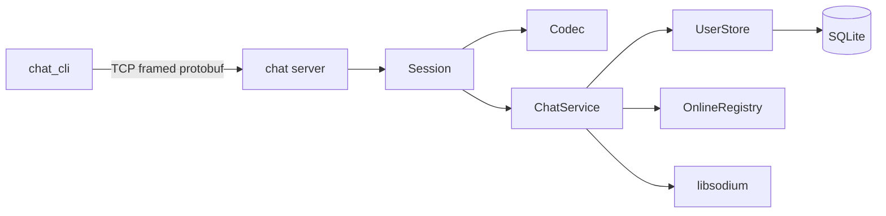
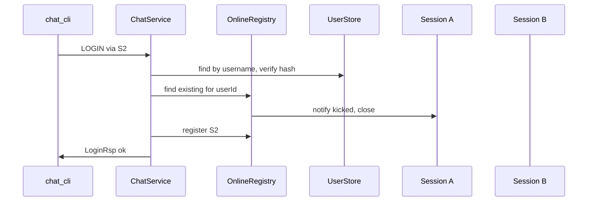

# feat: Boost 栈账号里程碑（SQLite + CLI）

## Summary

在现有 `Session` / `Codec` / `ChatService` 骨架上，实现注册、登录、登出与在线会话管理，接入 SQLite 与密码哈希；新增 C++ 交互 CLI 做端到端验收；删除全部 muduo 遗留代码并收敛 CMake。单聊、群聊、Web 接入不在本计划内。

## Problem Frame

仓库双栈并存：Boost 路径仅有桩逻辑，`src_bak` 与 `include/server` 仍承载 muduo + MySQL/Redis 实现。学习目标是先掌握 Boost.Asio + Protobuf 网络与会话模型，再按里程碑扩展 IM 能力。本计划落实 brainstorm 中的**账号里程碑**（见 `origin`）。

---

## Requirements

（承接 origin R1–R15；以下为计划验收表述）

- R1. CMake 仅构建 Boost + Protobuf 服务端与 CLI，无 muduo/MySQL/Redis。
- R2. 删除 `include/server/`、`src_bak/`、`test/testmuduo/` 等 muduo 时代目录。
- R3–R4. 保持长度前缀帧、读缓冲拆包、写队列（`src/Session.cpp`、`src/Codec.cpp` 已具备，查漏补缺即可）。
- R5. 断开连接时清理在线表与 Session 绑定。
- R6–R8. `ChatEnvelope` 路由；实现 REG/LOGIN/LOGINOUT；未实现 `MsgType` 返回明确错误。
- R9–R13. SQLite 用户表；注册唯一用户名；登录校验哈希；挤下线；禁止明文密码。
- R14–R15. C++ 交互 CLI，复用 `Codec` 与 `chat.pb.h`。

---

## Key Technical Decisions

- **KTD1 — 登录键：用户名 + 密码**  
  `LoginReq` 增加 `username` 字段（保留 `id` 供将来按 ID 登录，本阶段 CLI 只用用户名）。在 SQLite 按 `name` 查用户。  
  *Rationale:* 注册用用户名，CLI 演示更自然；与 origin「Deferred to Planning」一致。

- **KTD2 — 登出后保持 TCP**  
  处理 `LOGINOUT_MSG` 后发送 ack、清除绑定与在线表，**不**主动 `close` socket；用户可同一连接再次登录。断开连接仍走 `onDisconnect` 清理。  
  *Rationale:* 便于 CLI 菜单循环演示；满足 F3「登出」而不强制重连。

- **KTD3 — 密码哈希：libsodium `crypto_pwhash`**  
  使用 Argon2id（libsodium 默认），存储完整编码字符串；校验用 `crypto_pwhash_str_verify`。  
  *Rationale:* Homebrew 易安装、API 简单，强度满足 origin「bcrypt 或同等」；避免自研 bcrypt 绑定。

- **KTD4 — SQLite：单文件 + 薄封装**  
  库文件路径默认 `data/chat.db`（相对工作目录，启动时 `mkdir`）；`UserStore` 类封装 CRUD，ChatService 不直接写 SQL。  
  *Rationale:* 学习项目够用，与旧 MySQL Model 分层思路一致。

- **KTD5 — 在线表：`userId → weak_ptr<Session>`**  
  由 `ChatService` 持有 `OnlineRegistry`；登录注册、登出、断开、挤下线均经此类。  
  *Rationale:* 集中会话态，便于下一里程碑单聊推送。

- **KTD6 — 挤下线（R12）**  
  新登录成功前，若已有在线 Session：向旧连接发送 `LOGIN_MSG_ACK`（`errcode` 表示被挤下线）或专用通知后 `close` 旧 socket。  
  *Rationale:* 满足 AE3；实现简单、行为可感知。

- **KTD7 — 未实现消息**  
  对 `ONE_CHAT_MSG` 等：记录日志并向客户端返回带 `errcode` 的 ack 型响应（可复用各业务 `*Rsp` 的 `errcode/errmsg` 或新增轻量 `CommonRsp`）。  
  *Rationale:* 满足 R8，避免静默失败。

- **KTD8 — 错误码**  
  在 `include/ErrCode.hpp` 定义常量（成功、用户名重复、用户不存在、密码错误、未登录、未实现、被挤下线等），与 proto `int32 errcode` 对齐。  
  *Rationale:* 统一 CLI 打印与后续扩展。

---

## High-Level Technical Design

### 组件关系



### 登录与挤下线（序列）



---

## Output Structure

```text
include/
  ChatServer.hpp
  ChatService.hpp
  Session.hpp
  Codec.hpp
  ErrCode.hpp          # new
  store/
    UserStore.hpp      # new
  auth/
    PasswordHash.hpp   # new
src/
  ...
  store/UserStore.cpp  # new
  auth/PasswordHash.cpp
test/
  chat_cli.cpp         # new interactive client
  proto_client.cpp     # keep or slim as smoke test
data/                  # gitignore chat.db
proto/chat.proto       # extended messages
```

（删除：`include/server/`、`src_bak/`、`test/testmuduo/`、`CMakeLists.txt_bak` 等遗留）

---

## Implementation Units

### U1. 遗留清理与 CMake 收敛

**Goal:** 单栈工程，仅 Boost + Protobuf + SQLite + libsodium 目标。

**Requirements:** R1, R2

**Dependencies:** 无

**Files:**
- 删除：`include/server/`、`src_bak/`、`test/testmuduo/`、`test/testjson/`（若仅 muduo 实验）、`CMakeLists.txt_bak`
- 修改：`CMakeLists.txt`、`.gitignore`（忽略 `data/`、`bin/`）
- 可选删除：未使用的 `include/public.hpp`（枚举已由 proto 取代）

**Approach:**
- 移除 `find_package(Lua REQUIRED)`（当前未链接到 `chat`）。
- 确认 `chat` 与 `chat_cli`（U6）为唯二主目标；`proto_client` 可保留为 smoke test。
- 删除前快速对照 `src_bak/server/model/usermodel.cpp` 字段含义（username/password/state）已吸收到 KTD4 schema。

**Test scenarios:**
- Test expectation: none — 删除与构建配置；**Verification:** `cmake --build` 成功且无 muduo 路径引用。

---

### U2. 协议扩展（proto）

**Goal:** 支撑登出、用户名登录及统一错误语义。

**Requirements:** R6, R7

**Dependencies:** U1

**Files:**
- 修改：`proto/chat.proto`
- 生成：`generated/chat.pb.h`、`generated/chat.pb.cc`（现有 custom command）

**Approach:**
- `LoginReq`：增加 `string username = 3;`（`id` 保留）。
- 新增 `LogoutReq` / `LogoutRsp`（或 `LoginoutReq` 命名与 `LOGINOUT_MSG` 一致）。
- 可选 `CommonRsp { int32 errcode; string errmsg; }` 供未实现类型复用。
- 在 `MsgType` 中确认 `LOGINOUT_MSG` 有对应 ack 枚举值（若无则增加 `LOGINOUT_MSG_ACK`）。
- 文档注释标明 errcode 含义与 `ErrCode.hpp` 对应。

**Test scenarios:**
- 修改 `proto/chat.proto` 后 `protoc` 生成成功，`chat` 与 CLI 目标编译通过。

**Verification:** 生成头文件中可见新字段与消息类型。

---

### U3. 数据层：SQLite + 密码哈希

**Goal:** 用户持久化与密码安全存储。

**Requirements:** R9, R13；origin AE1

**Dependencies:** U2

**Files:**
- 新增：`include/store/UserStore.hpp`、`src/store/UserStore.cpp`
- 新增：`include/auth/PasswordHash.hpp`、`src/auth/PasswordHash.cpp`
- 修改：`CMakeLists.txt`（`find_package(SQLite3)`、`find_package(PkgConfig)` + libsodium 或 `find_library(sodium)`）

**Approach:**
- Schema（启动时 `CREATE TABLE IF NOT EXISTS`）:
  - `id INTEGER PRIMARY KEY AUTOINCREMENT`
  - `name TEXT UNIQUE NOT NULL`
  - `password_hash TEXT NOT NULL`
  - `state TEXT NOT NULL DEFAULT 'offline'`
- `UserStore::createUser(name, plainPassword)` → 哈希后 INSERT；冲突返回错误码。
- `UserStore::findByName` / `findById`；`updateState` 供演示在线态（可选，挤下线可不写 DB state）。
- `PasswordHash::hash` / `verify` 封装 libsodium，失败抛或返回 `expected` 风格错误。

**Test scenarios:**
- 注册用户后 DB 中 `password_hash` 非明文且每次注册不同盐值。
- 重复用户名注册返回「已存在」错误码。
- 正确/错误密码 `verify` 结果符合预期。

**Verification:** 可通过 U6 CLI 或临时 main 调用 `UserStore` 完成 AE1 前半段。

---

### U4. 在线会话注册表

**Goal:** 集中管理 userId 与 Session 绑定，支持挤下线与断开清理。

**Requirements:** R5, R10, R11, R12；origin AE3, AE4

**Dependencies:** U3

**Files:**
- 修改：`include/ChatService.hpp`、`src/ChatService.cpp`
- 新增：`include/OnlineRegistry.hpp`、`src/OnlineRegistry.cpp`（或内嵌于 ChatService 若保持极简）

**Approach:**
- `bind(userId, session)` / `unbind(session)` / `find(userId)` → `weak_ptr<Session>`。
- `kickExisting(userId, exceptSession)`：锁定旧 Session，`send` 踢下线 ack 后 `close`。
- 所有 map 操作在 `io_context` 线程（当前单线程 `io_context.run()`，直接调用即可；注释说明多线程时需 strand）。

**Test scenarios:**
- Covers AE3. 用户登录连接 A 后，连接 B 同账号登录成功，A 断开或收到踢下线响应，在线表仅 B。
- Covers AE4. 登出后在线表无该 userId；断开后同样清理。

**Verification:** 日志或 CLI 双终端手动验证。

---

### U5. ChatService 账号业务与消息路由

**Goal:** 实现注册、登录、登出；替换桩逻辑；未实现类型明确失败。

**Requirements:** R7–R12, R8；origin F1–F3, AE1–AE2

**Dependencies:** U2, U3, U4

**Files:**
- 修改：`src/ChatService.cpp`、`include/ChatService.hpp`
- 修改：`src/Session.cpp`（如需 `Session::resetAuth()` 清除 userId）

**Approach:**
- `reg`：`RegReq` → `UserStore::createUser` → `RegRsp`。
- `login`：`LoginReq.username` + password → 校验 → `kickExisting` → `session->setUserId` → `bind` → `LoginRsp`。
- `logout`：已绑定则 `unbind` + `resetAuth` → `LogoutRsp`；未登录返回 errcode。
- `onDisconnect`：若 `userId()!=0` 则 `unbind`（与 R5 一致）。
- `msg_handler_map_` 注册 `LOGINOUT_MSG`；其余未实现 handler 调用 `sendNotImplemented`。
- 启动时 `UserStore::init(dbPath)` 在 `main` 或 `ChatService` 单例初始化。

**Test scenarios:**
- Covers AE1. 注册 alice 成功；重复注册失败且 errcode 可区分。
- Covers AE2. 错误密码登录失败，Session `userId()==0`，在线表无记录。
- 未登录发 `LOGINOUT_MSG` 返回未登录错误，不崩溃。
- 发送 `ONE_CHAT_MSG` 返回未实现错误（R8）。

**Verification:** U6 CLI 跑通 origin Success Criteria 主路径。

---

### U6. C++ 交互 CLI 客户端

**Goal:** 里程碑端到端验收工具。

**Requirements:** R14, R15

**Dependencies:** U2, U5

**Files:**
- 新增：`test/chat_cli.cpp`（或 `src/client/chat_cli.cpp`）
- 修改：`CMakeLists.txt` → `add_executable(chat_cli ...)`

**Approach:**
- 同步 TCP + `protocol::pack`/`recvFrame`（可抽取 `test/proto_client.cpp` 的 `sendAll`/`recvFrame` 到 `include/NetUtil.hpp` 供 CLI 与 proto_client 共用，避免三份复制）。
- 菜单循环：1 注册 2 登录 3 登出 4 退出程序。
- 打印 `errcode` / `errmsg` / `id`。
- 默认 `127.0.0.1:6000`。

**Test scenarios:**
- 完整手动脚本：注册 → 登录 → 登出 → 错误密码登录（对应 origin Success Criteria）。
- 双开 CLI：验证挤下线提示。

**Verification:** 用户可按 README 步骤复现。

---

### U7. 文档与构建说明

**Goal:** 后续自己与 `ce-work` 可复现运行。

**Requirements:** R1；origin Success Criteria

**Dependencies:** U1–U6

**Files:**
- 修改：`README.md`

**Approach:**
- 依赖安装（Boost、protobuf@3、sqlite3、libsodium）。
- 构建与运行：`./bin/chat`、`./bin/chat_cli`。
- 明确 muduo 已移除；下一阶段预告单聊里程碑。

**Test scenarios:**
- Test expectation: none — 文档；**Verification:** 按 README 从零构建运行成功。

---

## Scope Boundaries

**In scope:** U1–U7；origin 账号里程碑全部要求。

**Deferred for later**（与 origin 一致，不进入本计划 Implementation Units）

- 单聊、好友、群组、离线消息、Redis。
- Web SPA / WebSocket 网关。
- `proto_client` 增强为自动化测试套件（可选跟进）。

**Deferred to Follow-Up Work**（实现时发现的可选清理）

- 删除 `test/echo_server.cpp` 若不再教学使用。
- 统一 `include/ChatServer.hpp` 中 `server` 类命名为 `ChatServer`（纯命名，非阻塞）。

**Outside this product's identity:** 多机部署、生产风控、MySQL 集群（见 origin）。

---

## Risks and Dependencies

| 风险 | 缓解 |
|------|------|
| Homebrew 上 protobuf@3 与 Boost include 顺序冲突 | 保持 `CMakeLists.txt` 中 `BEFORE PRIVATE` protobuf include |
| libsodium / SQLite 未安装导致链接失败 | README 写明 `brew install sqlite libsodium` |
| `weak_ptr` 挤下线时 Session 已销毁 | `lock()` 判空再 `send` |
| 删除 `src_bak` 后丢失业务参考 | U1 删除前完成字段对照（已写入 KTD4） |

**Dependencies:** Boost.Thread、Protobuf 3、SQLite3、libsodium；macOS Homebrew 路径与现有 CMake 一致。

---

## Open Questions

**Resolved in this plan（原 origin Deferred to Planning）**

- 登出后 TCP：保持（KTD2）。
- 登录键：用户名（KTD1）。
- 哈希：libsodium Argon2id（KTD3）。

**Deferred to implementation**

- `data/` 目录是否纳入仓库（建议仅 `.gitkeep` + gitignore `*.db`）。
- 踢下线通知用 `LoginRsp` 还是单独 `NotifyMsg`（U5 实现时二选一，优先 `LoginRsp` errcode）。

---

## Sources and Research

- 现有实现：`src/Session.cpp`、`src/Codec.cpp`、`src/ChatService.cpp`、`test/proto_client.cpp`
- 旧用户模型参考：`src_bak/server/model/usermodel.cpp`（删除前）
- Origin：`docs/brainstorms/2026-05-30-chatserver-boost-account-requirements.md`

---

## Suggested Implementation Order

```text
U1 → U2 → U3 → U4 → U5 → U6 → U7
```

U4 可与 U3 并行开发，但 U5 依赖两者。建议每完成一个 U 提交一次，便于回滚。
