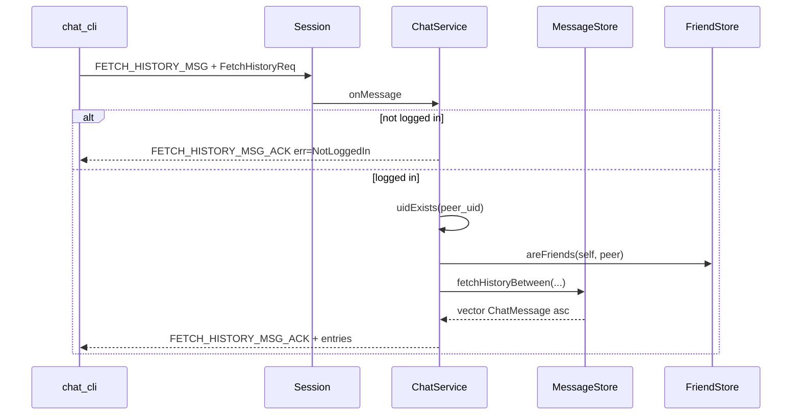

# feat: 单聊历史消息分页拉取

## Summary

为已登录用户提供与指定好友之间的**分页历史查询**（`FETCH_HISTORY_MSG`），复用 `chat_message` 表与现有关友/登录门禁；`chat_cli` 增加演示菜单。版本发布为 **v0.4.1**，与路线图中的群聊 **v0.4.0** 拆分，避免单里程碑过大。

## Problem Frame

当前仅能在登录时拉取 `delivered=0` 的离线消息，无法主动查看已投递过的历史记录。用户换终端或需要回顾对话时缺少 IM 必备的**历史漫游**能力（见 `origin`）。

---

## Requirements

（承接 origin R1–R12 与 Success Criteria）

- **R1–R5** 单聊历史：好友校验、`peer_uid` 有效、分页（`before_msg_id` 游标）、服务端 `limit` 上限、响应升序排列。
- **R6–R7** 不改变离线补发逻辑；不修改 `delivered` 字段。
- **R8–R10** 新 MsgType + `chat_cli` 菜单；未登录返回 `kNotLoggedIn`。
- **R11–R12** 双用户互发消息后分页连续；非好友 / 非法 uid 可区分错误码。

---

## Key Technical Decisions

- **KTD1 — 版本号：v0.4.1**  
  群聊保留 v0.4.0 规划；历史拉取独立 minor/patch，便于分 PR 与学习验收。  
  *Rationale:* 关闭 origin Open Questions。

- **KTD2 — MsgType：`FETCH_HISTORY_MSG` / `FETCH_HISTORY_MSG_ACK`（17 / 18）**  
  请求 `FetchHistoryReq`：`peer_uid`、`limit`、`before_msg_id`（0 表示最新一页）。  
  应答 `FetchHistoryRsp`：`errcode`、`errmsg`、`repeated HistoryEntry`（`msg_id`、`from_uid`、`to_uid`、`content`、`sent_at`）。  
  *Rationale:* 与现有 `*_MSG` / `*_ACK` 成对命名一致；字段与 `OneChatNotify` 对齐便于客户端复用展示逻辑。

- **KTD3 — `limit` 语义**  
  客户端 `limit <= 0` 时服务端按 **20** 处理；`limit > 100` 截断为 **100**（`kDefaultLimit=20`，`kMaxLimit=100`）。  
  *Rationale:* 关闭 origin 数值待定；学习阶段够用且防滥用。

- **KTD4 — SQL 查询：双向会话**  
  ```text
  WHERE (from_id = self AND to_id = peer) OR (from_id = peer AND to_id = self)
    AND (before_msg_id = 0 OR id < before_msg_id)
  ORDER BY id DESC LIMIT ?
  ```  
  查询结果在 C++ 层 **reverse** 为 id 升序再填入 proto。  
  *Rationale:* 不引入 `conversation_id`；与 origin Assumptions 一致。

- **KTD5 — 鉴权顺序（与 `oneChat` 一致）**  
  1. `session->uid() == 0` → 由 `onMessage` 统一 `kNotLoggedIn`（handler 内不重复）  
  2. `!uidExists(peer_uid)` → `kInvalidUid`  
  3. `!areFriends(self, peer)` → `kNotFriend`  
  4. 查询并返回列表（空列表 + `kOk` 合法）  
  *Rationale:* 满足 R12；复用 `UserStore` / `FriendStore`。

- **KTD6 — 登录门禁**  
  `FETCH_HISTORY_MSG` **不**加入 `allowsAnonymous`；与加好友、单聊相同。  
  *Rationale:* R10。

- **KTD7 — 不新增错误码**  
  复用 `kNotLoggedIn`、`kInvalidUid`、`kNotFriend`、`kInvalidRequest`、`kInternalError`。  
  *Rationale:* 行为已被现有常量覆盖。

---

## High-Level Technical Design

### 请求处理流



### 分页语义

| `before_msg_id` | 含义 |
|-----------------|------|
| `0` | 最新一页（id 最大的 N 条） |
| `> 0` | 严格小于该 id 的下一页（更早消息） |

客户端向上翻页：取本页最小 `msg_id` 作为下次请求的 `before_msg_id`。

---

## Scope Boundaries

### In scope

- 单聊历史分页、好友/登录校验、`chat_cli` 演示、`docs/VERSIONS.md` v0.4.1 章节

### Out of scope

- 群历史、会话列表、已读、撤回、搜索、富媒体、Web 网关（与 origin 一致）

### Deferred to Follow-Up Work

- v0.4.0 群聊（`CREATE_GROUP_MSG` 等）
- v0.5.0+ 已读回执、心跳增量同步、会话列表 API

---

## Implementation Units

### U1. 协议扩展

**Goal:** 定义历史拉取请求/应答消息类型与载荷。

**Requirements:** R8

**Dependencies:** 无

**Files:**

- Create: —
- Modify: `proto/chat.proto`
- Test: —（protobuf 生成由构建验证）

**Approach:**

- 在 `MsgType` 追加 `FETCH_HISTORY_MSG = 17`、`FETCH_HISTORY_MSG_ACK = 18`
- 新增 `FetchHistoryReq`、`FetchHistoryRsp`、`HistoryEntry`
- 更新 `proto/chat.proto` 顶部版本注释为 v0.4.1 能力说明

**Patterns to follow:** 现有 `OneChatReq` / `AddFriendReq` 字段风格；`errcode` + `errmsg` 应答惯例

**Test scenarios:**

- Test expectation: none — 纯协议定义；由 U3/U4 集成验证

**Verification:** `cmake --build` 成功生成 `generated/chat.pb.h` 且含新类型

---

### U2. MessageStore 历史查询

**Goal:** 封装双向单聊分页 SQL，返回升序消息列表。

**Requirements:** R3–R5

**Dependencies:** U1（类型可在实现时用 `ChatMessage` 结构，不依赖 proto）

**Files:**

- Modify: `include/store/MessageStore.hpp`
- Modify: `src/store/MessageStore.cpp`

**Approach:**

- 新增 `std::vector<ChatMessage> fetchHistoryBetween(int self_uid, int peer_uid, int limit, int64_t before_msg_id)`
- 内部：`ORDER BY id DESC LIMIT clamped_limit`，结果 reverse
- `limit` 在 store 层或调用方 clamp 均可；建议在 **ChatService** clamp 后传入，Store 仅执行查询

**Patterns to follow:** `fetchUndelivered` 的 stmt 绑定与行解析

**Test scenarios:**

- **Happy path:** self=1, peer=2，库中有 5 条双向消息；`before_msg_id=0, limit=3` 返回 id 最大的 3 条且升序
- **Edge case:** `before_msg_id` 设为当前最小 id，返回空 vector
- **Edge case:** 无共同消息，返回空 vector（非错误）
- **Edge case:** `limit=0` 传入前已被 clamp 为 20（在 U3 测）

**Verification:** 可通过 U4 手工验收；若有空档可后续加 store 单测（本计划不强制新测试目标）

---

### U3. ChatService 历史 Handler

**Goal:** 注册路由、校验、调用 Store、组装 `FetchHistoryRsp`。

**Requirements:** R1–R2, R6–R7, R10–R12

**Dependencies:** U1, U2

**Files:**

- Modify: `include/ChatService.hpp`
- Modify: `src/ChatService.cpp`

**Approach:**

- 构造函数 `msg_handler_map_` 注册 `FETCH_HISTORY_MSG` → `fetchHistory`
- `fetchHistory`：解析 `FetchHistoryReq` → 校验 peer → `message_store_.fetchHistoryBetween` → 填充 `repeated HistoryEntry` → `FETCH_HISTORY_MSG_ACK`
- 在 `sendNotLoggedIn` 的 `switch` 中增加 `FETCH_HISTORY_MSG` 分支（返回 `FetchHistoryRsp` 形态，与 `ONE_CHAT_MSG` 类似）
- **不**修改 `deliverOfflineMessages` / `oneChat`

**Patterns to follow:** `oneChat` 校验链；`addFriend` 应答封装

**Test scenarios:**

- **Happy path:** 已登录 A，与 B 为好友，互发 3 条后拉历史，`errcode=0`，条数=3，升序
- **Happy path:** 发 25 条，`limit=20` 首屏 20 条；`before_msg_id=最小id` 第二屏 5 条
- **Error path:** 未登录 → `kNotLoggedIn`
- **Error path:** `peer_uid` 不存在 → `kInvalidUid`
- **Error path:** 非好友 → `kNotFriend`
- **Integration:** 拉历史后 B 仍能通过登录收到未投递离线（`delivered=0` 未被历史接口改动）

**Verification:** 双终端 `chat_cli` 可复现 R11；错误码与 `ErrCode.hpp` 一致

---

### U4. chat_cli 演示菜单

**Goal:** 菜单项拉取并打印好友历史。

**Requirements:** R9, R11（验收载体）

**Dependencies:** U3

**Files:**

- Modify: `test/chat_cli.cpp`

**Approach:**

- 菜单增加 `9) fetch history`（或并入帮助文案）
- 提示输入 `peer_uid`、可选 `limit`、可选 `before_msg_id`（回车表示 0）
- 打印每条 `msg_id from_uid content`；`errcode!=0` 时打印 errmsg
- 注册成功后已自动登录（v0.3.2），可直接在注册+加好友+发消息后测历史

**Patterns to follow:** 菜单 6 `oneChat` 的 `exchange` + 解析 rsp 模式

**Test scenarios:**

- **Happy path:** 菜单 9 拉取刚发送的消息，输出与发送一致
- **Edge case:** 对非好友 uid 请求，CLI 显示 `kNotFriend`

**Verification:** 单终端脚本或手工完成 origin Success Criteria 第 2 条

---

### U5. 版本文档与路线图

**Goal:** 记录 v0.4.1 能力与验收步骤。

**Requirements:** Success Criteria 1

**Dependencies:** U3, U4

**Files:**

- Modify: `docs/VERSIONS.md`

**Approach:**

- 顶部 **当前最新版本** → v0.4.1
- 新增 v0.4.1 章节：能力表、协议、CLI 菜单 9、双终端验收步骤
- 路线图注明群聊仍为 v0.4.0

**Test scenarios:**

- Test expectation: none — 文档

**Verification:** 文档与实现行为一致

---

## System-Wide Impact

| 层面 | 影响 |
|------|------|
| 协议 | 新增 MsgType 17/18；旧客户端忽略未知类型 |
| 数据 | 只读 `chat_message`；无迁移 |
| 离线补发 | 无行为变化（R6） |
| 性能 | SQLite 全表扫描级查询；学习规模可接受；大表可后续加索引 `(from_id,to_id,id)`（**Deferred**） |

---

## Risks & Dependencies

| 风险 | 缓解 |
|------|------|
| 消息量大时无索引慢查询 | 本里程碑数据量小；文档 Deferred 索引优化 |
| `before_msg_id` 非法（不存在） | 视为游标：无匹配行则返回空列表 + `kOk`（与「无更多历史」一致） |

**前置：** v0.3.x 账号、好友、单聊、消息入库已就绪（当前仓库已满足）。

---

## Verification Strategy（里程碑）

1. `cmake --build build` 无错误
2. `./bin/chat` + 两个 `./bin/chat_cli`：
   - A、B 注册（自动登录）→ 互加好友 → 各发若干条
   - A 菜单 9 拉 B 的历史，条数与内容正确
   - A 设 `before_msg_id` 翻页无重复遗漏
   - C 用非法 uid / 非好友 uid 请求，错误码 12 / 9
3. B 离线时 A 发消息，B 登录仍收到 push（R6 回归）

---

## Sources & Research

- **Origin:** `docs/brainstorms/2026-05-30-chat-history-messaging-requirements.md`
- **Patterns:** `src/ChatService.cpp`（`oneChat`、`onMessage` 门禁）、`src/store/MessageStore.cpp`（`fetchUndelivered`）
- **现状版本:** `docs/VERSIONS.md` v0.3.2

---

## Open Questions（实现时可关闭）

- 是否在 `chat_message` 上添加复合索引 — 本里程碑 **不做**，写入 Deferred
- `proto_client` 是否增加冒烟 — **可选**，非验收必需
