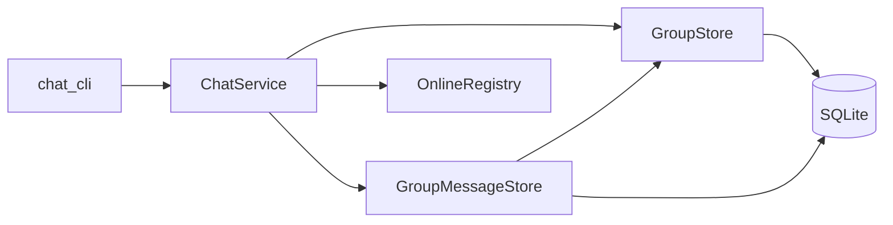
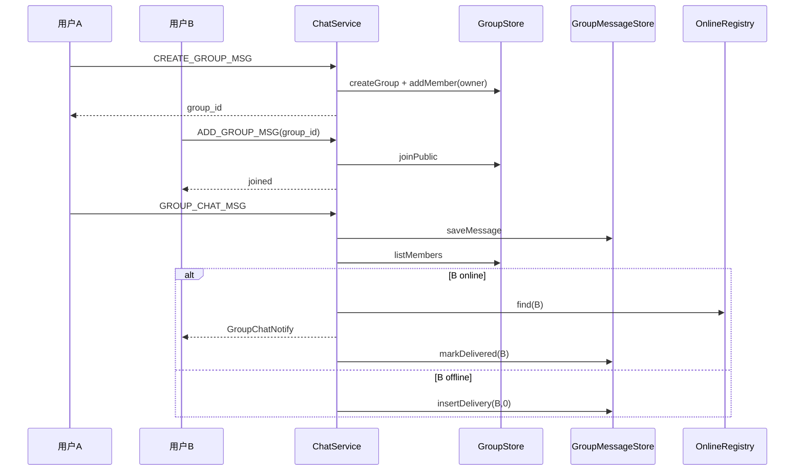
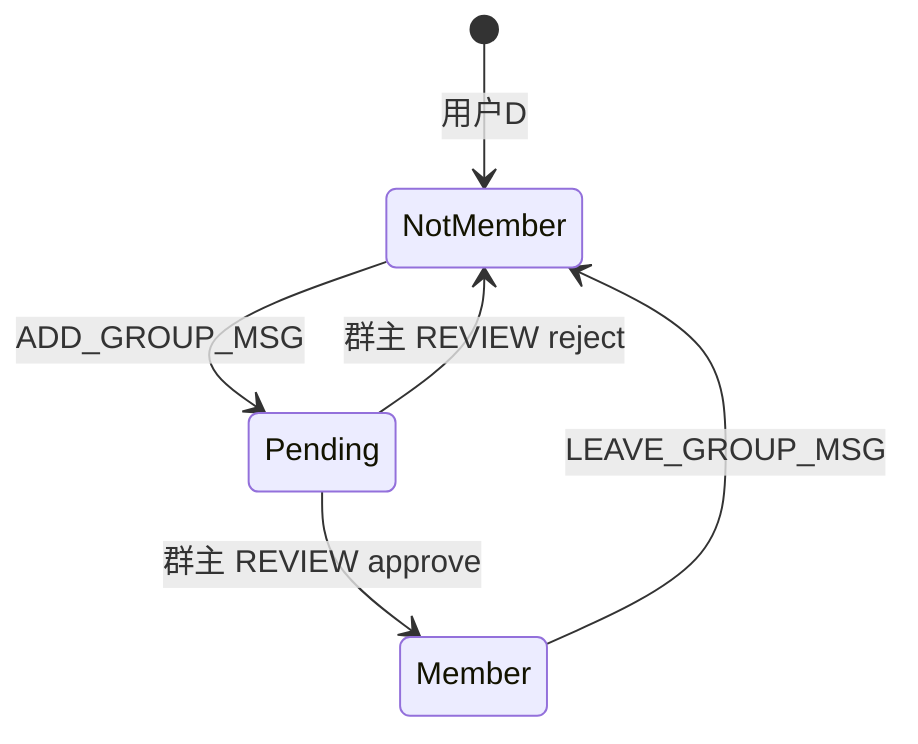

# feat: 群聊（建群 / 加群 / 群消息 / 历史 / 列表）

## Summary

在现有 Boost + Protobuf + SQLite 栈上实现 **v0.4.0 群聊里程碑**：建群（名称、简介、公开/需审批）、凭 `group_id` 加入或申请、群主审批、群文本消息（实时 + 登录离线补发）、群历史分页、我的群列表、成员退群。复用 `ChatService` 分发与 `OnlineRegistry` 推送模式，新增 `GroupStore` / `GroupMessageStore`，扩展 `proto/chat.proto` 与 `chat_cli`。与已发布的 **v0.4.1 单聊历史** 独立版本号（见 origin）。

## Problem Frame

当前协议枚举已预留 `CREATE_GROUP_MSG` / `ADD_GROUP_MSG` / `GROUP_CHAT_MSG`，但 handler 落入 `notImplemented`，无群元数据、成员关系与群消息持久化，无法演示多人群聊（见 `origin` Problem & Outcome）。

---

## Requirements

（承接 origin R1–R22）

- **R1–R7** 群组与成员：建群、群主、公开/需审批加入、退群、成员/人数上限（200/50）、非法 `group_id` 与越权错误。
- **R8–R11** 群消息：持久化、在线 fan-out 推送、per-member 离线未投递、登录补发；**不**要求好友关系。
- **R12–R14** 群历史分页（语义对齐单聊 `FETCH_HISTORY`）；我的群列表；历史不改变投递状态。
- **R15–R17** 协议与登录门禁；`chat_cli` 全路径演示（含审批）。
- **R18–R22** 双终端验收：公开群、需审批群、离线补发、退群拒绝、上限错误。

---

## Key Technical Decisions

- **KTD1 — 版本号：v0.4.0**  
  单聊历史已发布为 v0.4.1；群聊占用路线图中的 v0.4.0 编号，避免与 origin 拆分策略冲突。

- **KTD2 — 保留枚举 8/9/10，补充 ACK 与新类型（从 19 起递增）**  
  | 值 | 常量 | 用途 |
  |----|------|------|
  | 8 | `CREATE_GROUP_MSG` | 建群请求 |
  | 19 | `CREATE_GROUP_MSG_ACK` | 建群应答 |
  | 9 | `ADD_GROUP_MSG` | 加入/申请入群（自助 `group_id`） |
  | 20 | `ADD_GROUP_MSG_ACK` | 加入应答（`joined` / `pending`） |
  | 10 | `GROUP_CHAT_MSG` | 发群消息 / 应答 / 推送（同 `ONE_CHAT_MSG` 三态） |
  | 21 | `LIST_MY_GROUPS_MSG` / `22` `_ACK` | 我的群列表 |
  | 23 | `FETCH_GROUP_HISTORY_MSG` / `24` `_ACK` | 群历史分页 |
  | 25 | `LEAVE_GROUP_MSG` / `26` `_ACK` | 退群 |
  | 27 | `LIST_JOIN_REQUESTS_MSG` / `28` `_ACK` | 群主拉待审批列表 |
  | 29 | `REVIEW_JOIN_REQUEST_MSG` / `30` `_ACK` | 群主批准/拒绝 |

  *Rationale:* 关闭 origin Open Question「编号在 18 之后」；不改动已发布 1–18。

- **KTD3 — 加入模式 `JoinMode`（proto enum）**  
  `PUBLIC = 0`：直接入群；`APPROVAL_REQUIRED = 1`：写入 `group_join_request` 待群主处理。  
  *Rationale:* origin R3–R4。

- **KTD4 — 待审批：Pull API，无主动推送（v0.4.0）**  
  新申请**不**向群主发实时 Notify；群主通过 `LIST_JOIN_REQUESTS_MSG` 拉列表，CLI 演示时手动刷新。  
  *Rationale:* 关闭 origin「推送给群主还是 pull」；实现量小，学习验收足够。后续可加 `JOIN_REQUEST_NOTIFY`（Deferred）。

- **KTD5 — `GroupChatNotify` 携带 `group_id` + `group_name`**  
  便于 CLI 打印、与单聊 `from_name` 对称。  
  *Rationale:* 关闭 origin Notify 字段问题。

- **KTD6 — 数据模型（SQLite，同库 `data/chat.db`）**

  ```text
  chat_group(id, name, description, join_mode, owner_uid, created_at)
  group_member(group_id, user_id, joined_at)          -- PK (group_id, user_id)
  group_join_request(id, group_id, applicant_uid, status, created_at)
      -- status: pending / approved / rejected; UNIQUE(group_id, applicant_uid) WHERE pending 用应用层保证
  group_message(id, group_id, from_uid, content, sent_at)
  group_message_delivery(msg_id, user_id, delivered) -- 每个接收成员一行；发送者不插入
  ```

  *Rationale:* origin 方案 B；群消息 fan-out 用 delivery 表表达 per-member 离线，避免在 `group_message` 上无法表达「部分成员未读」。

- **KTD7 — 上限常量**  
  `kMaxGroupMembers = 200`，`kMaxGroupsPerUser = 50`；在 `GroupStore` 入群/建群路径校验。  
  *Rationale:* origin R7。

- **KTD8 — 新增错误码（`include/ErrCode.hpp`）**

  | 值 | 常量 | 场景 |
  |----|------|------|
  | 14 | `kGroupNotFound` | `group_id` 不存在 |
  | 15 | `kNotGroupMember` | 非成员发消息/拉历史 |
  | 16 | `kAlreadyInGroup` | 重复加入 |
  | 17 | `kGroupFull` | 单群 ≥200 |
  | 18 | `kUserGroupLimit` | 用户 ≥50 群 |
  | 19 | `kJoinPending` | 需审批群已有待审申请 |
  | 20 | `kNotGroupOwner` | 非群主审批/拉申请列表 |
  | 21 | `kJoinNotPending` | 审批时申请不存在或已处理 |

  继续复用：`kNotLoggedIn`、`kInvalidRequest`、`kInvalidUid`（申请人不存在时）、`kInternalError`。

- **KTD9 — 群历史分页**  
  与单聊一致：`limit` 默认 20、最大 100；`before_msg_id=0` 为最新一页；SQL `ORDER BY id DESC LIMIT` 后 reverse 升序。  
  鉴权：已登录 + `isMember(group_id)`。  
  *Rationale:* origin R12–R14；对齐 `MessageStore::fetchHistoryBetween` 心智。

- **KTD10 — 登录离线补发**  
  `establishUserSession` 在现有 `deliverOfflineMessages`（单聊）之后调用 `deliverOfflineGroupMessages`：按 `group_message_delivery` 拉 `delivered=0`，推送 `GroupChatNotify` 并标记已投递。  
  *Rationale:* origin R10；不替代历史接口。

- **KTD11 — 发群消息 fan-out**  
  1. 校验成员；`saveGroupMessage` 得 `msg_id`  
  2. 查询 `group_member` 除发送者外所有 `user_id`  
  3. 对每个成员：在线 → `pushGroupChatNotify` + `markDelivered`；离线 → `insert delivery delivered=0`  
  *Rationale:* 对齐 `oneChat` + 多接收者扩展。

- **KTD12 — `ChatService::init`**  
  增加 `group_store_.init(db_path)` 与 `group_message_store_.init(db_path)`（可同文件两次 `sqlite3_open` 与现 `FriendStore`/`MessageStore` 一致，或后续合并连接 — **本里程碑保持与现模式一致**）。

---

## High-Level Technical Design

### 组件关系



### 公开群：建群到首条消息



### 需审批群



---

## Scope Boundaries

### In scope

- 建群、公开/需审批加入、群主审批、退群、群消息、离线补发、群历史、我的群列表、CLI、`docs/VERSIONS.md` v0.4.0

### Out of scope

- 踢人、解散、转让群主、管理员、@、已读、富媒体、Web、统一会话列表（与 origin 一致）

### Deferred to Follow-Up Work

- 入群申请实时 Notify 群主
- `chat_message` / `group_message` 复合索引优化
- `proto_client` 群聊冒烟（可选）
- 建群时批量拉初始成员 uid（origin Deferred）

---

## Output Structure

```text
include/
  ErrCode.hpp                    # 修改
  ChatService.hpp                # 修改
  store/GroupStore.hpp           # 新增
  store/GroupMessageStore.hpp    # 新增
src/
  ChatService.cpp                # 修改
  store/GroupStore.cpp           # 新增
  store/GroupMessageStore.cpp    # 新增
proto/chat.proto                 # 修改
test/chat_cli.cpp                # 修改
docs/VERSIONS.md                 # 修改
CMakeLists.txt                   # 修改（追加 store 源文件）
```

---

## Implementation Units

### U1. 协议与错误码

**Goal:** 定义群聊相关 message 类型、载荷与业务错误码。

**Requirements:** R15

**Dependencies:** 无

**Files:**

- Modify: `proto/chat.proto`
- Modify: `include/ErrCode.hpp`

**Approach:**

- 按 KTD2 追加 `MsgType` 与请求/应答 message（`CreateGroupReq/Rsp`、`JoinGroupReq` 用 `ADD_GROUP_MSG` 载荷名可定为 `JoinGroupReq` 等，保持字段清晰）
- `GroupChatNotify` 含 `group_id`、`group_name`、`from_uid`、`from_name`、`content`、`sent_at`
- `FetchGroupHistoryReq` 与单聊对齐：`group_id`、`limit`、`before_msg_id`
- 更新 `proto/chat.proto` 顶部版本注释为 v0.4.0

**Patterns to follow:** `FetchHistoryReq` / `AddFriendReq` 应答惯例

**Test scenarios:**

- Test expectation: none — 由构建与 U4+ 集成验证

**Verification:** `cmake --build build` 生成 `generated/chat.pb.h` 且含新枚举与 message

---

### U2. GroupStore（群元数据 / 成员 / 申请）

**Goal:** 封装建群、入群、审批、退群、列表与上限校验。

**Requirements:** R1–R7, R13（列表数据）

**Dependencies:** U1（错误码常量）

**Files:**

- Create: `include/store/GroupStore.hpp`, `src/store/GroupStore.cpp`
- Modify: `CMakeLists.txt`

**Approach:**

- `init(db_path)` 建表 `chat_group`、`group_member`、`group_join_request`
- `createGroup(owner_uid, name, description, join_mode)` → `group_id`
- `joinPublic(uid, group_id)` / `requestJoin(uid, group_id)`
- `approveJoin(owner_uid, group_id, applicant_uid)` / `rejectJoin(...)`
- `leaveGroup(uid, group_id)`
- `isMember(uid, group_id)`、`isOwner(uid, group_id)`、`groupExists(group_id)`
- `countMembers(group_id)`、`countUserGroups(uid)`
- `listMyGroups(uid)` → `vector<GroupSummary>`
- `listPendingRequests(owner_uid, group_id)`
- 上限与重复加入、待审重复在 Store 或 ChatService 层返回对应 `errcode`

**Patterns to follow:** `src/store/FriendStore.cpp`（schema、`sqlite3` 绑定）

**Test scenarios:**

- **Happy path:** 建群后 owner 在 `group_member`；公开群第二人加入成功
- **Happy path:** 需审批群产生 `pending` 记录；approve 后出现在 `group_member`
- **Error path:** 第 201 个成员 → `kGroupFull`
- **Error path:** 用户第 51 个群 → `kUserGroupLimit`
- **Error path:** 重复加入 → `kAlreadyInGroup`
- **Error path:** 重复 pending 申请 → `kJoinPending`

**Verification:** U4 handler 可驱动 Store；或临时在 `main` 打日志（非必需单测目标）

---

### U3. GroupMessageStore（群消息与按成员投递）

**Goal:** 群消息持久化、per-member delivery、历史分页、未投递查询。

**Requirements:** R8, R10, R12, R14

**Dependencies:** U2（`isMember` 由 ChatService 先校验）

**Files:**

- Create: `include/store/GroupMessageStore.hpp`, `src/store/GroupMessageStore.cpp`
- Modify: `CMakeLists.txt`

**Approach:**

- 表 `group_message`、`group_message_delivery`
- `saveGroupMessage(from_uid, group_id, content)` → `msg_id`, `sent_at`
- `insertUndelivered(msg_id, user_id)` 批量插入除发送者外成员
- `fetchUndeliveredForUser(uid)` → 带 `group_id` 的消息列表（JOIN `group_message`）
- `markDelivered(msg_id, user_id)`
- `fetchGroupHistory(group_id, limit, before_msg_id)` → 升序 `vector<GroupMessage>`
- 退群后：不再为该用户插入新 delivery；已有未投递可在登录时补发（退群前产生）— **实现时** 退群不删历史行，仅阻止新消息 fan-out 目标（`listMembers` 不含退群用户）

**Patterns to follow:** `src/store/MessageStore.cpp`（`saveMessage`、`fetchUndelivered`、`fetchHistoryBetween`）

**Test scenarios:**

- **Happy path:** 发一条消息后 delivery 表行数 = 成员数 − 1
- **Happy path:** `markDelivered` 后 `fetchUndelivered` 不再返回
- **Happy path:** 群内 5 条消息，历史首页 `limit=3` 返回最新 3 条升序
- **Edge case:** `before_msg_id` 超出范围 → 空列表 + 合法

**Verification:** 与 U5/U6 联调

---

### U4. ChatService — 群生命周期 Handler

**Goal:** 建群、加入/申请、审批、退群、我的群列表、待审列表。

**Requirements:** R1–R7, R13, R16–R17（服务端部分）

**Dependencies:** U1, U2

**Files:**

- Modify: `include/ChatService.hpp`, `src/ChatService.cpp`

**Approach:**

- 成员：`GroupStore group_store_`；`init` 中初始化
- 注册 handler：`CREATE_GROUP_MSG`、`ADD_GROUP_MSG`、`LIST_MY_GROUPS_MSG`、`LEAVE_GROUP_MSG`、`LIST_JOIN_REQUESTS_MSG`、`REVIEW_JOIN_REQUEST_MSG`
- 各 handler：解析 proto → 登录已在 `onMessage` 保证 → 调用 Store → 专用 Rsp
- 扩展 `sendNotLoggedIn` 的 `switch` 覆盖新请求类型（返回对应 Ack 形态）
- **本单元不**实现 `GROUP_CHAT_MSG`、离线补发、群历史

**Patterns to follow:** `addFriend`、`fetchHistory` 校验与 `sendEnvelope`

**Test scenarios:**

- **Happy path:** Covers AE 公开群路径 — A 建群 B `group_id` 加入，列表可见
- **Happy path:** Covers AE 审批群 — D 申请 pending，C 批准后 D `isMember`
- **Error path:** 非群主 `LIST_JOIN_REQUESTS` → `kNotGroupOwner`
- **Error path:** 非法 `group_id` → `kGroupNotFound`
- **Integration:** 建群后 `LIST_MY_GROUPS` 对 A 返回 1 条且 `is_owner=true`

**Verification:** 双终端 + 日志或 U7 CLI 子集

---

### U5. ChatService — 群消息发送与离线补发

**Goal:** 群聊实时推送与登录后群离线补发。

**Requirements:** R8–R11, R18, R20

**Dependencies:** U2, U3, U4

**Files:**

- Modify: `include/ChatService.hpp`, `src/ChatService.cpp`

**Approach:**

- 注册 `GROUP_CHAT_MSG` → `groupChat`
- `groupChat`：成员校验 → `saveGroupMessage` → 遍历成员 fan-out（KTD11）
- `pushGroupChatNotify` 私有方法；`msgid=GROUP_CHAT_MSG`
- `establishUserSession` 末尾调用 `deliverOfflineGroupMessages(uid)`
- 发送者收到 `GroupChatRsp`（含 `msg_id`）；不给自己发 Notify

**Patterns to follow:** `oneChat`、`deliverOfflineMessages`、`pushOneChatNotify`

**Test scenarios:**

- **Happy path:** A、B 同群在线，A 发消息 B 收到 Notify 且含 `group_name`
- **Happy path:** B 离线，A 发消息；B 登录后收到 Notify，delivery 标记已投递
- **Error path:** 非成员发消息 → `kNotGroupMember`
- **Integration:** 单聊离线补发仍正常（先单聊后登录，再测群，回归 R6 等价）

**Verification:** Covers AE R18、R20 的推送与补发部分

---

### U6. ChatService — 群历史 Handler

**Goal:** 成员按群分页拉取历史。

**Requirements:** R12, R14

**Dependencies:** U1, U3, U4

**Files:**

- Modify: `include/ChatService.hpp`, `src/ChatService.cpp`

**Approach:**

- 注册 `FETCH_GROUP_HISTORY_MSG` → `fetchGroupHistory`
- 校验 `isMember`；`clampHistoryLimit` 复用现有匿名命名空间常量
- 调用 `group_message_store_.fetchGroupHistory`；填充 `GroupHistoryEntry`
- 不修改 `delivered` 状态

**Patterns to follow:** `fetchHistory`

**Test scenarios:**

- **Happy path:** 发 5 条后拉历史得 5 条升序
- **Happy path:** `before_msg_id` 翻页无重复遗漏
- **Error path:** 非成员 → `kNotGroupMember`
- **Integration:** 拉历史不影响离线队列（发消息→离线→登录补发→再拉历史）

**Verification:** Covers AE R20 历史部分

---

### U7. chat_cli 群聊菜单

**Goal:** 端到端演示全部群能力。

**Requirements:** R17, R18–R22（验收载体）

**Dependencies:** U4, U5, U6

**Files:**

- Modify: `test/chat_cli.cpp`

**Approach:**

- 扩展菜单（建议 10–16，具体编号实现时连续即可），例如：
  - 建群（名称、简介、模式）
  - 加入群（`group_id`）
  - 发群消息
  - 我的群列表
  - 拉群历史
  - 退群
  - 群主：列出待审批 / 批准 / 拒绝
- 循环内继续 `drainNotifications` 以打印 `GroupChatNotify`
- 更新文件头注释版本为 v0.4.0

**Patterns to follow:** 菜单 5/6/9 的 `exchange` 模式

**Test scenarios:**

- **Happy path:** 菜单走完 R18 公开群脚本
- **Happy path:** 菜单走完 R19 审批群脚本
- **Error path:** 退群后再发群消息，CLI 显示 `kNotGroupMember`
- **Edge case:** 满员群加入失败提示 `kGroupFull`

**Verification:** 里程碑 Verification Strategy 全部可手工执行

---

### U8. 版本文档

**Goal:** 记录 v0.4.0 能力与验收。

**Requirements:** 里程碑发布

**Dependencies:** U7

**Files:**

- Modify: `docs/VERSIONS.md`
- Modify: `README.md`（当前版本一句，若仍写 v0.3.0）

**Approach:**

- 顶部 **当前最新版本** → v0.4.0（或 v0.4.1 与 v0.4.0 并存说明：以实际发布顺序为准 — **若群聊后发布则最新为 v0.4.0 之后可写 v0.4.2 或保持 0.4.1 为最新仅文档补 v0.4.0 章节**）
  - **决策：** 仓库已发布 v0.4.1；群聊实现后 **当前最新版本写 v0.4.2** 或 **在 VERSIONS 中新增 v0.4.0 群聊章节且顶部写「功能最新 v0.4.2（群聊）」** — 实现时采用：**新增 v0.4.0 群聊章节，顶部最新版本改为 v0.4.2（群聊）** 以避免版本号倒退混淆。*(Plan-time note for implementer: 若坚持路线图号 v0.4.0，文档章节标题用 v0.4.0，顶部可写「当前功能版本 v0.4.2」。)*
- 简化：**章节标题 `v0.4.0 — 群聊`**，顶部 `当前最新版本：v0.4.2`（群聊在 v0.4.1 历史之后发布）。在 U8 执行时由 implementer 二选一并在 VERSIONS 说明顺序。

**Test scenarios:**

- Test expectation: none

**Verification:** 文档与协议/菜单一致

---

## System-Wide Impact

| 层面 | 影响 |
|------|------|
| 协议 | 新增 MsgType 19–30；旧客户端对未知类型仍 `notImplemented` |
| 数据 | 新表；与现有 `user`/`friend`/`chat_message` 共存；无破坏性迁移 |
| 登录路径 | `establishUserSession` 增加群离线补发，单聊补发保持 |
| 性能 | 群发 O(成员数) 查在线 + 写 delivery；200 人学习规模可接受 |
| `CMakeLists.txt` | 追加 2 个 store 源文件 |

---

## Acceptance Examples

- **AE1（R18）:** A 建公开群 → B `group_id` 加入 → 互发群消息，在线均收 Notify。
- **AE2（R19）:** C 建需审批群 → D 申请 → C 批准 → D 可发消息；拒绝路径 err 明确。
- **AE3（R20）:** B 离线期间群内新消息 → B 登录补发 → `FETCH_GROUP_HISTORY` 翻页连续。
- **AE4（R21）:** E 退群后 `GROUP_CHAT_MSG` / 群历史 → `kNotGroupMember`。
- **AE5（R22）:** 满 200 人再加 → `kGroupFull`；用户 50 群后再加 → `kUserGroupLimit`。

---

## Risks & Dependencies

| 风险 | 缓解 |
|------|------|
| 群发 200 人阻塞事件循环 | 学习项目可接受；文档注明 Deferred 异步 fan-out |
| `group_join_request` 并发重复申请 | 应用层查 pending + UNIQUE 约束 |
| 版本号与已发布 v0.4.1 交错 | U8 明确文档顺序（见 U8） |

**前置：** v0.3.x 账号、好友、单聊、v0.4.1 历史（当前 `develop` 已满足）。

---

## Verification Strategy（里程碑）

1. `cmake --build build` 无错误
2. `./bin/chat` + 两个 `./bin/chat_cli`：
   - AE1 公开群 + 实时消息
   - AE2 审批群批准/拒绝
   - AE3 离线补发 + 群历史翻页
   - AE4 退群后拒绝发消息
   - AE5 上限错误码（可用小上限临时改常量做冒烟，**可选**；默认 200/50）
3. 回归：单聊加好友、单聊离线、单聊历史菜单 9 仍正常

---

## Sources & Research

- **Origin:** `docs/brainstorms/2026-05-30-group-chat-messaging-requirements.md`
- **Patterns:** `src/ChatService.cpp`（`oneChat`、`fetchHistory`、`deliverOfflineMessages`）、`src/store/MessageStore.cpp`、`src/store/FriendStore.cpp`
- **Prior plan:** `docs/plans/2026-05-30-002-feat-chat-history-fetch-plan.md`（分页与 limit 惯例）
- **现状:** `proto/chat.proto` 枚举 8–10 占位；`getHandler` 缺省 → `notImplemented`

---

## Open Questions（实现时可关闭）

- VERSIONS 顶部版本号：v0.4.2 vs 复用标题 v0.4.0 — 见 U8，implementer 落地时选一种并写清发布顺序
- `group_join_request` 是否在 approve 后保留记录 — 建议保留 `approved` 状态便于审计，非验收必需
