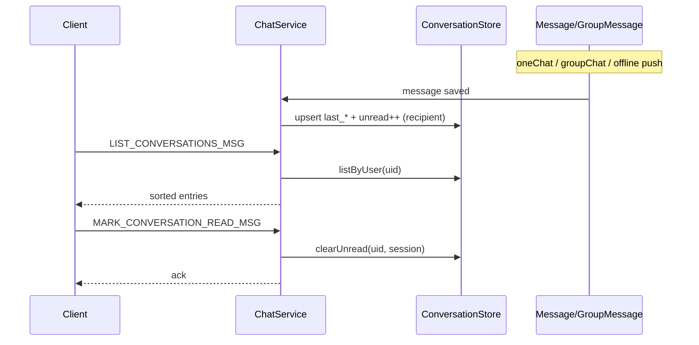

# feat: 会话列表与未读数（校园内测 M2）

## Summary

为已登录用户提供**统一收件箱**：单聊 + 群聊会话混排列表（最近消息摘要、时间、未读红点），并支持**进入会话标已读**。新增 `ConversationStore` 与 `LIST_CONVERSATIONS` / `MARK_CONVERSATION_READ` 协议；在单聊/群聊发送与推送路径维护会话元数据。版本 **v0.4.3**，为校园内测 M2，不包含 TLS/Web/心跳（见 origin M1/M3）。

## Problem Frame

用户无法一眼看到「谁找我、几条未读」，只能记 `uid`/`group_id` 调历史或群列表（见 origin M2 R5–R7）。Web 内测客户端（M3）依赖本 API 作为首页数据源。

---

## Requirements

（承接 origin M2 R5–R7）

- **R5**：会话列表 API，字段含 `session_type`、`target_id`、`title`、`last_msg_preview`、`last_msg_at`、`unread_count`。
- **R6**：在线推送**不**自动标已读；客户端打开会话或调用标已读接口后 `unread_count` 归零。
- **R7**：列表按 `last_msg_at` 降序；**仅展示有过消息的会话**（无消息的好友/群不出现）。

---

## Key Technical Decisions

- **KTD1 — 版本：v0.4.3**  
  校园内测 M2 独立 minor；与 v0.4.2 群聊、v0.5.0 已读回执路线图区分。  
  *Rationale:* origin 推荐顺序中 M2 为后端第一刀。

- **KTD2 — 存储：`conversation_state` 表**  
  ```text
  conversation_state(
    user_id, session_type, target_id,  -- PK
    title,              -- 展示名：好友用户名或群名（冗余，便于列表）
    last_msg_id, last_msg_at, last_preview,
    last_read_msg_id,
    unread_count
  )
  ```  
  `session_type`: `1=PEER`, `2=GROUP`。  
  *Rationale:* 统一单聊/群聊收件箱；避免每次列表全表扫描消息。

- **KTD3 — 未读语义（内测简化）**  
  - 收到**入站**消息并推送时（含登录离线补发）：对应会话 `unread_count += 1`，并更新 `last_*`。  
  - **发送方**自己的会话行只更新 `last_*`，不增加未读。  
  - `MARK_CONVERSATION_READ`：将 `last_read_msg_id` 设为当前 `last_msg_id`（或请求携带 `read_through_msg_id`），`unread_count = 0`。  
  - **不**改动现有 `chat_message.delivered` / `group_message_delivery.delivered` 离线补发语义。  
  *Rationale:* 满足 origin R6；与 transport `delivered` 解耦。

- **KTD4 — MsgType 编号**  
  | 值 | 常量 |
  |----|------|
  | 31 | `LIST_CONVERSATIONS_MSG` |
  | 32 | `LIST_CONVERSATIONS_MSG_ACK` |
  | 33 | `MARK_CONVERSATION_READ_MSG` |
  | 34 | `MARK_CONVERSATION_READ_MSG_ACK` |

- **KTD5 — `title` 填充**  
  - PEER：`UserStore` 好友用户名（`findByUid(target_id)`）。  
  - GROUP：`GroupStore::getGroupName`。  
  列表时若缺失则回查，写入 state 时尽量带上。

- **KTD6 — 鉴权**  
  - `LIST_CONVERSATIONS`：已登录即可。  
  - `MARK_CONVERSATION_READ`：须为会话参与方（单聊为好友关系 + 目标 uid 存在；群为 `isMember`）。非法会话返回 `kInvalidRequest` 或 `kNotGroupMember` / `kNotFriend`。

- **KTD7 — 与 `LIST_MY_GROUPS` 关系**  
  保留现有群列表 API；收件箱为**另一视图**（按最近消息排序，含单聊）。不删除 `LIST_MY_GROUPS`。

---

## High-Level Technical Design

### 数据流



### 维护点（须在实现中挂钩）

| 事件 | 发送方会话 | 接收方会话 |
|------|------------|------------|
| `oneChat` 成功 | 更新 last_*，unread 不变 | 若 push/offline：unread++ |
| `groupChat` fan-out | 更新 last_* | 每个其他成员 unread++ |
| `deliverOfflineMessages` | — | 每条补发 unread++ |
| `deliverOfflineGroupMessages` | — | 每条补发 unread++ |

---

## Scope Boundaries

### In scope

- `conversation_state` 表与 `ConversationStore`
- 列表 / 标已读 API + `chat_cli` 演示
- 发送与离线补发路径维护会话
- `docs/VERSIONS.md` v0.4.3

### Out of scope

- TLS、心跳、重连（origin M1）
- Web 客户端（origin M3）
- 好友列表 API、昵称（origin M4）
- 已读回执双蓝勾、已读同步给对方（v0.5+）
- 无消息好友/群也展示（采用 R7「仅有消息会话」）

### Deferred to Follow-Up Work

- origin M1/M3/M4/M5 独立计划
- 列表分页（内测用户少，一次返回全部）
- `last_msg_preview` 长度截断策略优化（首版可截断 80 字符）

---

## Implementation Units

### U1. 协议与错误码

**Goal:** 定义会话列表与标已读消息类型。

**Requirements:** R5, R6（协议面）

**Dependencies:** 无

**Files:**

- Modify: `proto/chat.proto`

**Approach:**

- 新增 `SessionType` enum：`SESSION_PEER=1`, `SESSION_GROUP=2`
- `ConversationEntry`：`session_type`, `target_id`, `title`, `last_msg_preview`, `last_msg_at`, `last_msg_id`, `unread_count`
- `ListConversationsReq`（空）/ `ListConversationsRsp`
- `MarkConversationReadReq`：`session_type`, `target_id`, 可选 `read_through_msg_id`
- `MarkConversationReadRsp`：`errcode`, `errmsg`

**Test scenarios:**

- Test expectation: none — 构建验证

**Verification:** `cmake --build` 生成新类型

---

### U2. ConversationStore

**Goal:** 封装会话状态 CRUD 与未读计数。

**Requirements:** R5–R7

**Dependencies:** U1

**Files:**

- Create: `include/store/ConversationStore.hpp`, `src/store/ConversationStore.cpp`
- Modify: `CMakeLists.txt`

**Approach:**

- `init(db_path)` 建表 `conversation_state`
- `touchOutgoing(user, session, preview, msg_id, sent_at)` — 发送方更新 last_*，unread 清零或不变
- `touchIncoming(user, session, title, preview, msg_id, sent_at)` — `unread_count++`，更新 last_*
- `listConversations(user_id)` — `ORDER BY last_msg_at DESC`
- `markRead(user_id, session, read_through_msg_id)` — 校验会话存在后 `unread_count=0`，更新 `last_read_msg_id`
- `getUnread(user, session)` 可选调试

**Patterns to follow:** `src/store/GroupStore.cpp`（schema/SQLite 绑定）

**Test scenarios:**

- **Happy path:** A 发单聊给 B 后，B 的 PEER 行 unread=1，last_preview 正确
- **Happy path:** 标已读后 unread=0
- **Edge case:** 重复标已读幂等返回 ok
- **Integration:** 群聊两条消息 unread=2，标读后为 0

**Verification:** U4 可调用 Store 完成列表/标已读

---

### U3. ChatService 挂钩（写路径）

**Goal:** 发消息与离线补发时维护会话状态。

**Requirements:** R6

**Dependencies:** U2

**Files:**

- Modify: `include/ChatService.hpp`, `src/ChatService.cpp`

**Approach:**

- 成员 `ConversationStore conversation_store_`；`init` 中初始化
- 私有方法 `notifyConversationOnOneChat(from, to, msg)` / `notifyConversationOnGroupChat(...)`
- 在 `oneChat` 成功 fan-out 后调用
- 在 `groupChat` 成员循环 push/insertDelivery 后调用
- 在 `deliverOfflineMessages` / `deliverOfflineGroupMessages` 每条 push 时对接收方 `touchIncoming`
- 发送方在发消息路径调用 `touchOutgoing`

**Patterns to follow:** 现有 `pushOneChatNotify` 邻近逻辑

**Test scenarios:**

- **Happy path:** 发单聊后 LIST 可见会话且 unread 正确
- **Integration:** 离线补发后未标已读前 unread>0
- **Integration:** 发送方 LIST 中同会话 unread=0

**Verification:** 双终端发消息后列表符合预期

---

### U4. ChatService 读路径（列表 / 标已读）

**Goal:** 注册 handler 与登录门禁。

**Requirements:** R5, R6, R7

**Dependencies:** U1, U2, U3

**Files:**

- Modify: `include/ChatService.hpp`, `src/ChatService.cpp`

**Approach:**

- Handler：`listConversations`, `markConversationRead`
- `sendNotLoggedIn` 增加两 MsgType 分支
- `markConversationRead` 校验好友/成员关系

**Patterns to follow:** `fetchHistory`, `listMyGroups`

**Test scenarios:**

- **Happy path:** 登录后 LIST 返回降序会话
- **Error path:** 未登录 `kNotLoggedIn`
- **Error path:** 对非好友 peer 标已读 → `kNotFriend`
- **Error path:** 非群成员标群会话 → `kNotGroupMember`

**Verification:** Covers origin R5–R7 验收意图

---

### U5. chat_cli 演示

**Goal:** 菜单拉取收件箱并标已读。

**Requirements:** R5, R6（验收载体）

**Dependencies:** U4

**Files:**

- Modify: `test/chat_cli.cpp`

**Approach:**

- 菜单 `18) list conversations`：打印会话行与 unread
- 菜单 `19) mark conversation read`：选择 type（1 peer / 2 group）、target_id
- 登录/注册后可选先 LIST 再看历史

**Patterns to follow:** 菜单 13 `my groups`

**Test scenarios:**

- **Happy path:** 发消息后 18 可见 unread=1，19 后 unread=0

**Verification:** 可手工完成校园内测 M2 子集验收

---

### U6. 版本文档

**Goal:** 记录 v0.4.3。

**Requirements:** 里程碑记录

**Dependencies:** U5

**Files:**

- Modify: `docs/VERSIONS.md`
- Modify: `README.md`（当前版本一句）

**Approach:**

- 顶部最新版本 → v0.4.3
- 新增章节：能力、协议 31–34、CLI 18–19、验收步骤
- 校园内测总览中注明 M2 已完成，M1/M3 仍待办

**Test scenarios:**

- Test expectation: none

**Verification:** 文档与实现一致

---

## System-Wide Impact

| 层面 | 影响 |
|------|------|
| 写路径 | `oneChat`/`groupChat`/离线补发多几次 Store 写；学习规模可接受 |
| 读路径 | 新 API，旧客户端忽略未知 MsgType |
| 数据 | 新表；与消息表无 FK，靠应用层维护 |
| Web（后续） | M3 客户端首屏依赖本 API |

---

## Acceptance Examples

- **AE1:** A→B 单聊后，B 执行列表 API 见 1 条 PEER 会话，`unread_count=1`，`title` 为 A 的用户名。
- **AE2:** B 标已读后 `unread_count=0`；A 侧同会话 unread 仍为 0。
- **AE3:** 群内发 2 条消息，成员 C 列表 unread=2；标读后为 0。
- **AE4:** 无聊天记录的好友不出现在列表中。

---

## Risks & Dependencies

| 风险 | 缓解 |
|------|------|
| 推送与 unread 重复计数 | 仅 `touchIncoming` 路径 ++；发送方走 `touchOutgoing` |
| `title` 与改名不同步 | 内测可接受；列表可懒更新 |
| 离线补发 + 在线已收重复 | 保持 delivered 逻辑不变；unread 仅由 touch 维护 |

**前置：** v0.4.2 单聊/群聊/历史已就绪。

---

## Verification Strategy

1. `cmake --build build`
2. `./bin/chat` + 两个 `chat_cli`：
   - 互加好友 → A 发单聊 → B 菜单 18 见 unread=1 → 19 标已读 → 18 为 0
   - 建群 → 发 2 条群消息 → 成员 18 见 unread=2
3. 回归：菜单 6/12/9/14 单聊群聊历史仍正常

---

## Sources & Research

- **Origin:** `docs/brainstorms/2026-05-30-im-campus-beta-v1-requirements.md`（M2）
- **Patterns:** `src/ChatService.cpp`（`oneChat`, `deliverOffline*`, `listMyGroups`）
- **Prior plan:** `docs/plans/2026-05-30-003-feat-group-chat-plan.md`

---

## Open Questions（实现时关闭）

- `last_msg_preview` 截断长度 — 默认 80 字符 UTF-8 安全截断可 deferred 到实现
- 是否返回 `last_msg_id` 供 Web 增量 — **包含**于 `ConversationEntry`，便于后续 M1 `last_msg_id` 同步
